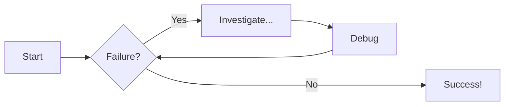
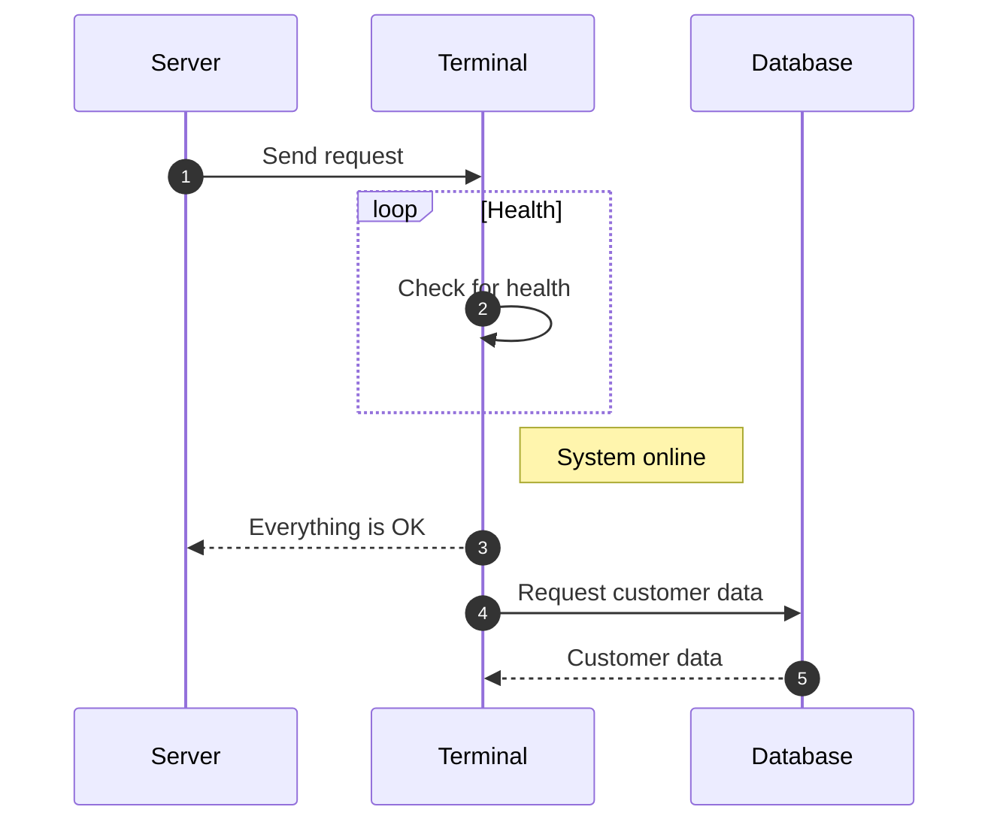
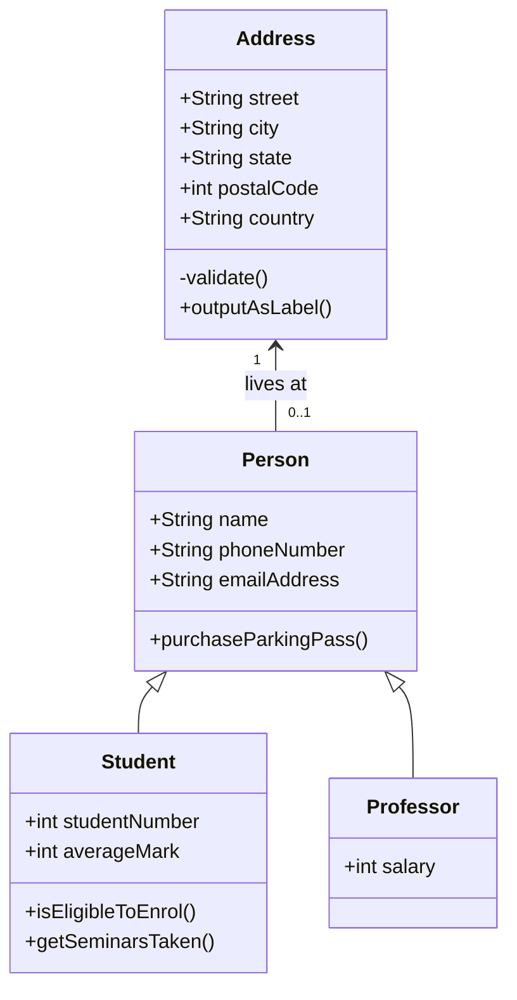

An example of a codeblock for Python:

### Code Blocks

=== "Python Code"

    ```py title='add_numbers.py' linenums='1' hl_lines='6'

    # Function to add two numbers
    def add_two_numbers(num1, num2):
        return num1 + num2

    # Example usage
    result = add_two_numbers(5, 3)
    print('The sum is:', result)
    ```

=== "The code again"

    ```py title='add_numbers.py' linenums='1' hl_lines='7'
    # Function to add two numbers
    def add_two_numbers(num1, num2):
        return num1 + num2

    # Example usage
    result = add_two_numbers(5, 3)
    print('The sum is:', result)
    ```

!!! note "This is amazing"

    Where are we?

??? note "This is hidden"

    Where are we?

## Flowchart



## Sequence Diagrams



